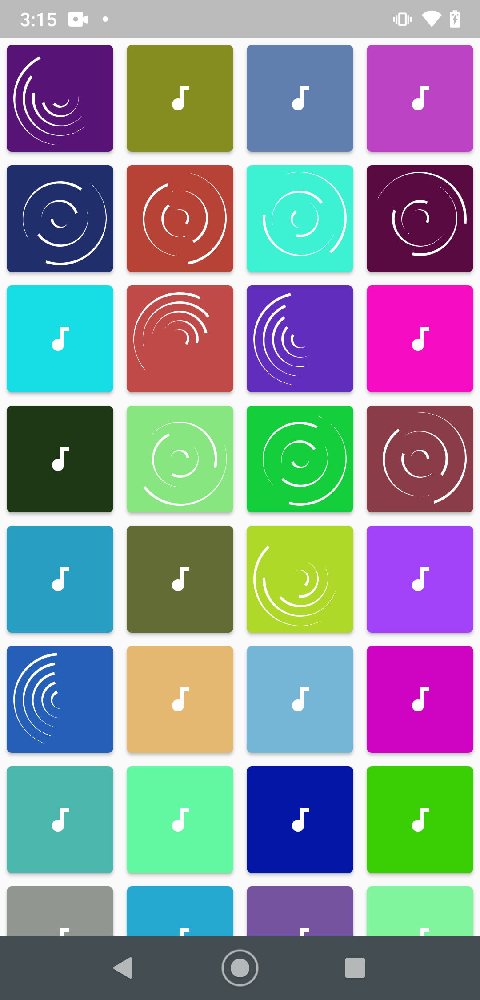

# Xylophone 🎹

## Our Goal

In this tutorial we will be diving into more Dart programming concepts and learning how to use open source Flutter packages. By the end of this module, you should be comfortable using Flutter packages and building repeated widgets.

## What i created from angela course

# Screenshots
    

We’re going to make a music app that plays Xylophone sounds. For every Beethoven out there, this will let you unleash your musical talent where ever you are. 

>This is a companion project to The App Brewery's Complete Flutter Development Bootcamp, check out the full course at [www.appbrewery.co](https://www.appbrewery.co/)

